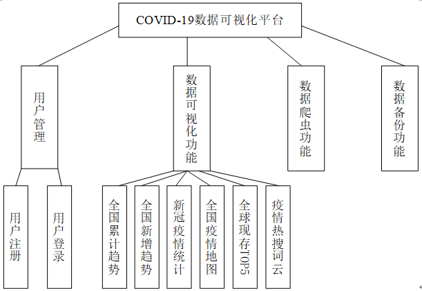
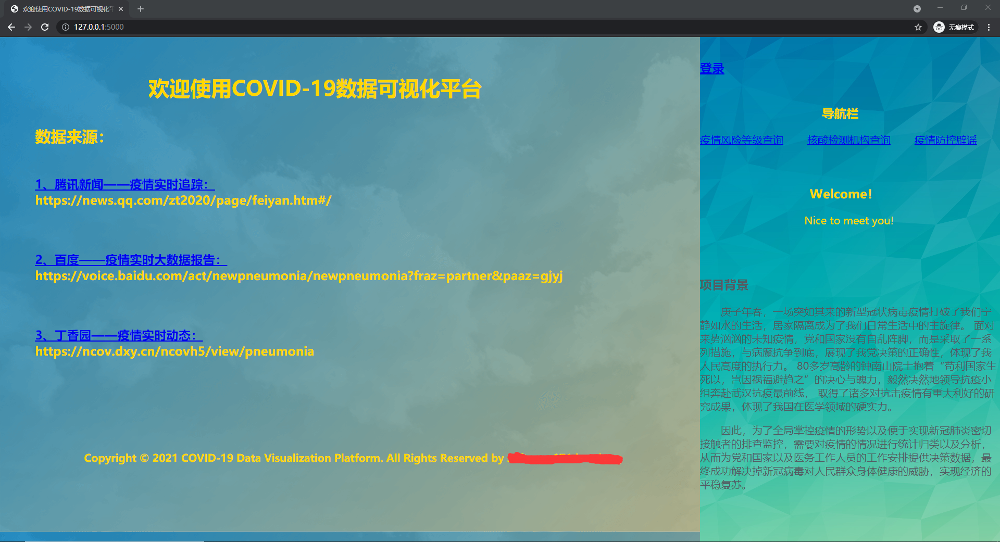
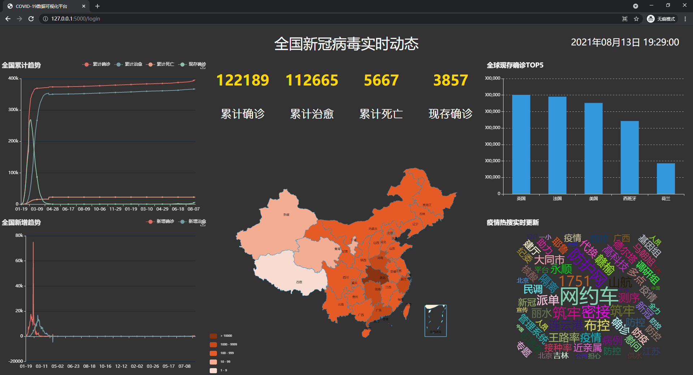
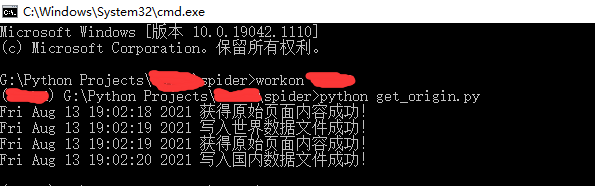
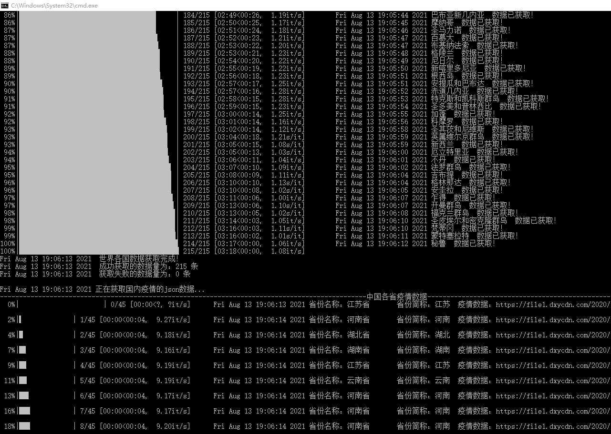
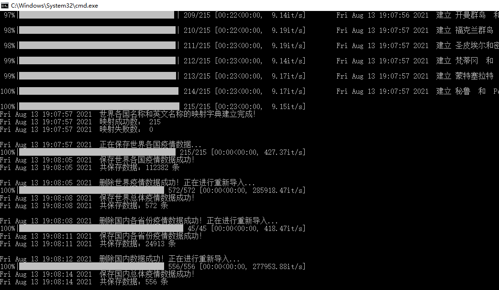
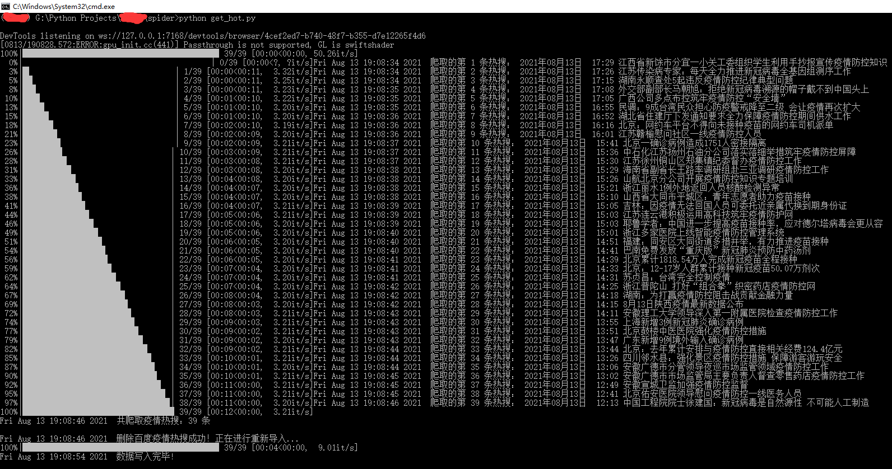

##项目介绍
    本项目采用基于Python的Flask框架，搭配百度开源的JavaScript框架库Echarts，并结合Python爬虫技术，实现COIVD-19新冠疫情病例数据的可视化展示。

##项目技术
* Python
* Flask
* Echarts
* Ajax
* MySQL
* Linux
* Nginx
* ...

##功能介绍

##模块展示
###1. 首页

###2. 可视化主页

###3. get_origin爬虫

###4. get_json爬虫

###5. get_data爬虫

###6. get_hot爬虫

###7. get_new爬虫

###8. 数据备份
* 通过部署在Linux中，编写shell脚本，以crontab定时任务的方式定时备份数据